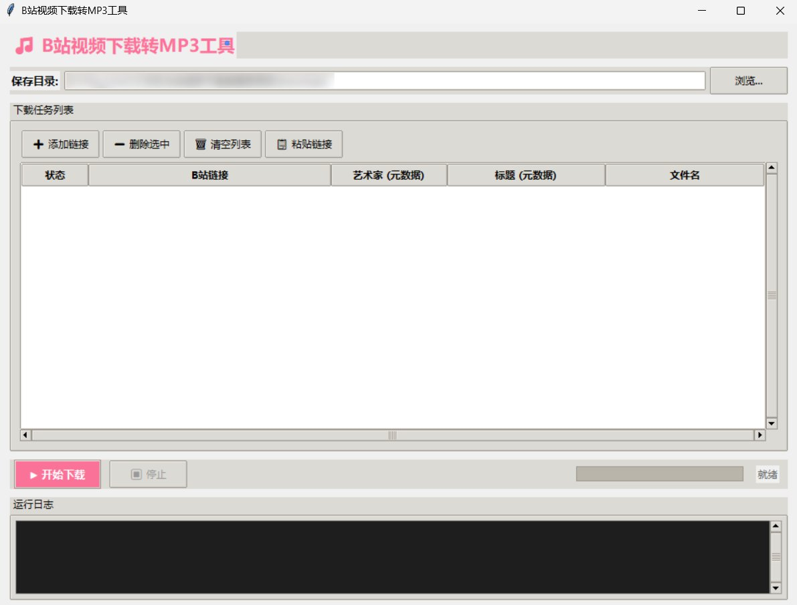

# B站视频下载转MP3工具

一款简洁高效的 B站视频下载与音频转换工具，支持批量下载、视频封面提取、MP3元数据自定义写入。
声明：此程序由AI生成


---

## 界面预览



---

## 功能特性

- **视频下载** — 支持 B站视频链接（BV号）和短链接（b23.tv），批量下载
- **音频转换** — 自动调用 ffmpeg 将视频转为 MP3（192kbps）
- **封面下载** — 自动下载视频封面，与 MP3 同名保存（`.jpg`）
- **元数据写入** — 将「艺术家」「标题」写入 MP3 ID3 标签，并嵌入封面作为专辑图片
- **批量处理** — 支持一次性添加多条链接，批量转换
- **自定义命名** — 可为每个任务单独指定文件名，留空则自动使用视频原标题
- **配置记忆** — 自动保存下载目录到配置文件，重启后自动恢复
- **停止/中断** — 下载过程中可随时停止，无需等待全部完成
- **BBDown 支持** — 优先使用 BBDown 下载，速度更快更稳定
- **关键词匹配** — 自动根据视频标题中的关键词填写艺术家名称
- **书名号提取** — 自动提取标题中《》内的内容作为歌曲标题和文件名
- **智能获取信息** — 添加链接时自动获取视频标题，提前预览下载内容

---

## 安装与运行

### 前置条件

1. **Python 3.8 或更高版本**（需包含 tkinter 模块）
   - 推荐从 [python.org](https://www.python.org/downloads/) 下载安装，安装时勾选 `Add Python to PATH` 和 `tcl/tk and IDLE`
   - 如果通过 Microsoft Store 安装，请改用官网安装版（Microsoft Store 版不含 tkinter）

2. **ffmpeg**（用于音频转换）
   - 下载地址：[https://ffmpeg.org/download.html](https://ffmpeg.org/download.html)
   - 下载后需将 `bin` 文件夹添加到系统 PATH 环境变量
   - 验证方法：打开 CMD，输入 `ffmpeg -version`，有版本输出即为成功

3. **BBDown（可选，但推荐）**
   - 下载地址：[https://github.com/nilaoda/BBDown/releases](https://github.com/nilaoda/BBDown/releases)
   - 将 `BBDown.exe` 放置在程序目录下即可
   - BBDown 下载速度更快，支持更多视频格式

### 启动方式

双击运行目录下的 **`启动工具.bat`**，脚本会自动：
1. 检测 Python 环境
2. 安装所需依赖（yt-dlp、mutagen）
3. 启动程序

---

## 使用说明

### 操作步骤

1. **选择保存目录** — 点击「浏览...」选择 MP3 和封面的保存位置（首次运行默认为程序目录下的 `download` 文件夹）
2. **添加下载任务**
   - 点击「➕ 添加链接」逐条添加，输入 B站视频链接
   - 点击「📋 粘贴链接」从剪贴板批量导入（支持多行，自动识别所有 B站链接）
   - 添加时会自动获取视频标题（如果 BBDown 可用）
3. **设置元数据**（可选）— 双击表格单元格进行编辑：
   - **艺术家** — 写入 MP3 的艺术家（ID3 TPE1），留空则使用关键词匹配或 UP 主名称
   - **标题** — 写入 MP3 的歌曲标题（ID3 TIT2），留空则使用书名号提取内容或视频原标题
   - **文件名** — MP3 和封面图片的文件名（不含扩展名），留空则使用书名号提取内容或视频原标题
4. **开始下载** — 点击「▶ 开始下载」，进度条和日志会实时显示处理状态
5. **停止下载** — 点击「⏹ 停止」可随时中断

### 设置功能

点击「⚙ 设置」按钮打开设置对话框：

- **书名号提取** — 启用后自动从视频标题中提取《》内的内容作为标题和文件名
- **关键词匹配** — 添加关键词和对应的艺术家名称，添加任务时自动匹配填写

### 输出文件

每个任务完成后，会在保存目录下生成两个文件：

| 文件 | 说明 |
|------|------|
| `视频标题.mp3` | 转换后的 MP3 音频，嵌入封面和元数据 |
| `视频标题.jpg` | 下载的视频封面图片 |

---

## 常见问题

### 程序无法启动，提示找不到 Python 或 tkinter
- 确保从 python.org 官网安装 Python，而非 Microsoft Store
- 安装时勾选 `Add Python to PATH` 和 `tcl/tk and IDLE`

### ffmpeg 相关错误
- 确保 ffmpeg 已安装并添加到 PATH，重启电脑后生效
- 验证方法：打开新的 CMD 窗口，输入 `ffmpeg -version`

### BBDown 检测失败
- 确保 `BBDown.exe` 放置在程序目录下
- 程序会自动检测并优先使用 BBDown
- 如果 BBDown 不可用，会自动回退到 yt-dlp

### 下载失败或速度慢
- B站视频下载需要登录用户的 cookie 信息，yt-dlp 默认使用公共接口，可能有速率限制
- 如遇高码率视频下载失败，可尝试添加 `--extractor-args "bilibili:cookies=NICECOOKIE"` 参数

### 保存目录配置不生效
- 配置文件 `config.json` 位于程序同目录下
- 可手动编辑或删除该文件，程序下次启动时将恢复默认路径

### 关键词匹配不生效
- 确保在设置对话框中正确添加了关键词和艺术家名称
- 关键词匹配是在添加任务时自动进行的

---

## 技术架构

| 组件 | 技术 |
|------|------|
| GUI 界面 | Python tkinter（标准库） |
| 视频下载 | [yt-dlp](https://github.com/yt-dlp/yt-dlp) / [BBDown](https://github.com/nilaoda/BBDown) |
| 音频转换 | [ffmpeg](https://ffmpeg.org/) |
| MP3 元数据 | [mutagen](https://github.com/quodlibet/mutagen) |
| 语言 | Python 3.8+ |

---

## 项目文件

```
B站视频下载转音频项目/
├── bilibili_to_mp3.py    # 主程序
├── requirements.txt      # Python 依赖清单
├── 启动工具.bat          # Windows 一键启动脚本
├── BBDown.exe            # BBDown 下载工具（需自行下载）
├── LICENSE              # AGPL-3.0 许可证
├── README.md            # 项目说明
├── Preview.jpg          # 界面预览图
├── config.json          # 配置文件（自动生成）
└── download/            # 默认下载目录（首次运行自动创建）
```

---

## 免责声明

本工具仅供个人学习与研究使用。请尊重版权，合理使用，切勿用于任何商业或非法用途。下载内容的相关版权由原著作权人所有。